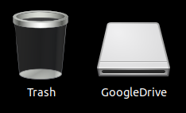
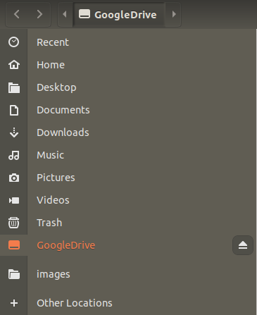

* Rev.1: 2023-06-03 (Sat)
* Draft: 2020-11-19 (Thu)

# Googld Drive
## Synchronizing Google Drive to a local device
* Files on your Google Drive can be stored on a local device and access them.
* You can
  * choose folders on your computer to sync with Google Drive
  * backup to Google Photos, and 
  * access all of your content directly from your PC or Mac.

## Download
google search: google drive sync
* https://www.google.com/drive/download/

## Install
### In Korean
* [우분투 리눅스에 구글 드라이브 설치하기](kr/how-to-install/INSTALL-on-ubuntu_linux.md)
* [윈도우10에 구글 드라이브 설치하기](kr/how-to-install/INSTALL-on-windows10.md)

## Example: Ubuntu Linux
* When the Google Drive is mounted, you will see 'GoogleDrive' on the 'Desktop' screen. 
* Double-click to open the directory and use it.

You will also see 'GoogleDrive' in the 'Files' program.

