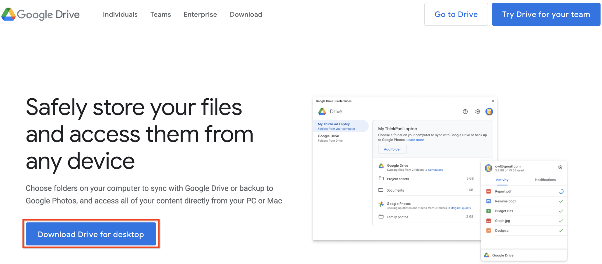
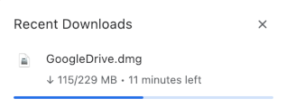
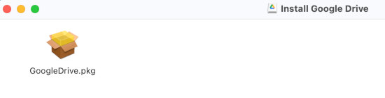
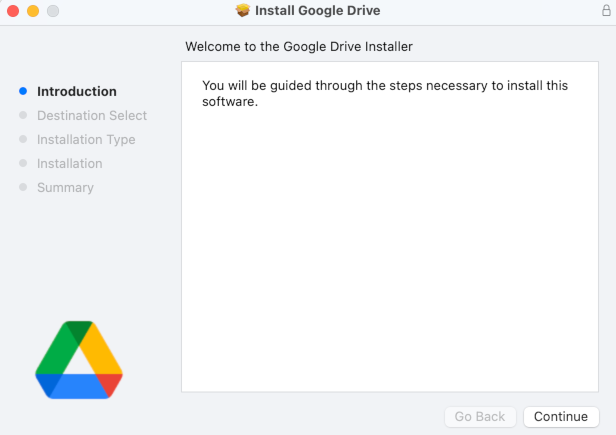
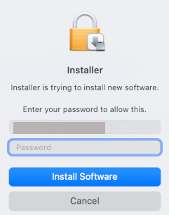
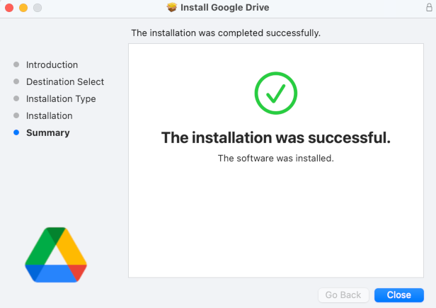
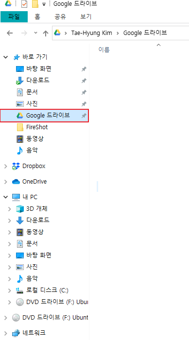

* Draft: 2023-06-03 (Sat)
* Draft: 2020-11-20 (Fri)

# macOS에 구글 드라이브 설치하기

## Download
google search: google drive sync
* https://www.google.com/drive/download/

**Download Drive for desktop**을 클릭하면 다운로드가 자동으로 시작됩니다.

## Install
다운로드 받은 `GoogleDrive.pkg` 파일을 실행합니다.

Continue를 눌러서 설치를 진행합니다. 일반적인 프로그램을 설치하는 것과 방법과 절차는 비슷합니다.

## 사용하기
설치가 완료되면 트레이에 구글 드라이브 아이콘이 보입니다.

탐색기에도 `Google 드라이브`가 자동으로 마운트 되어 있습니다.

동기화가 이미 진행되고 있습니다. 파일의 총 용량이 클 경우 동기화되는데 시간이 꽤 소요될 수 있습니다.
